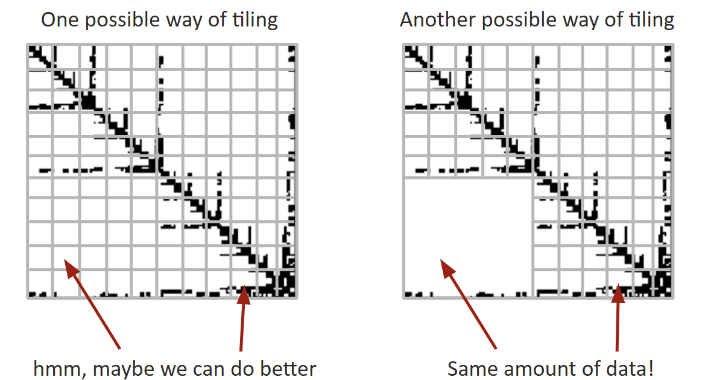
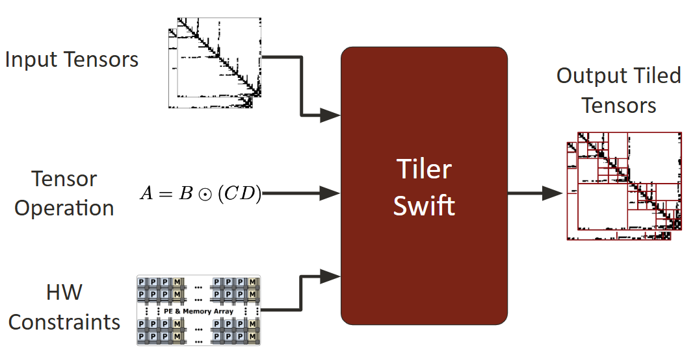
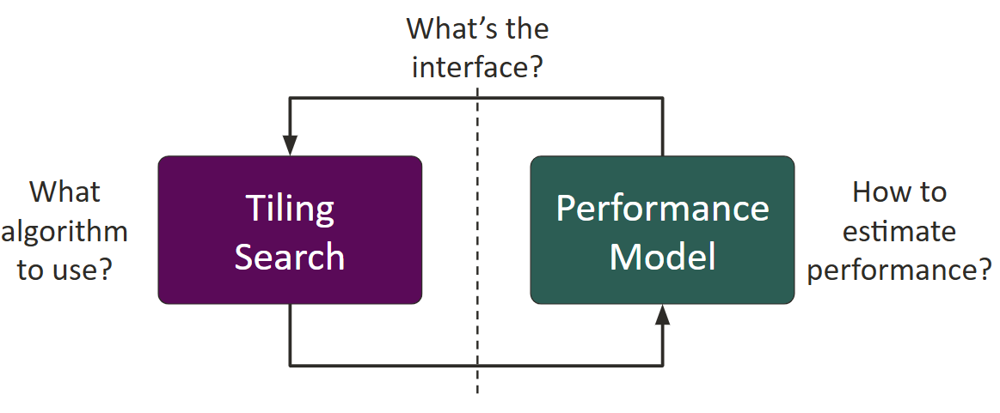
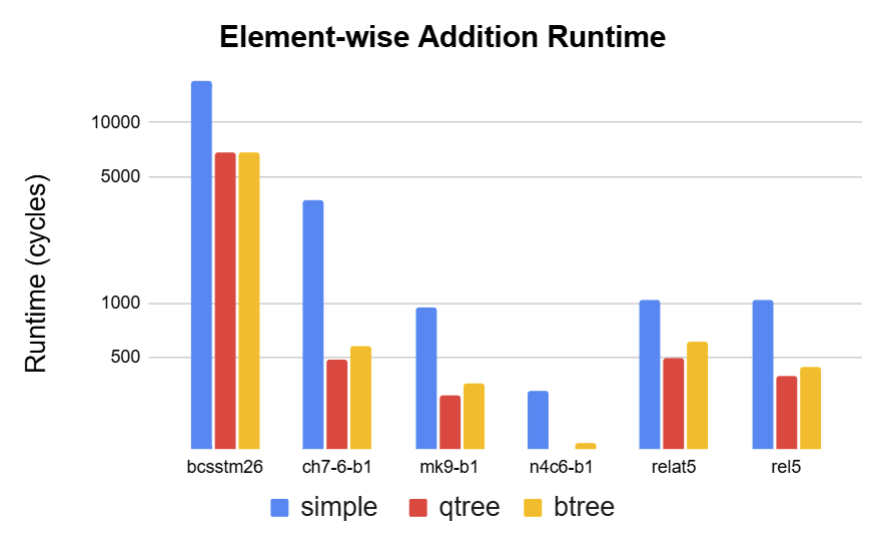
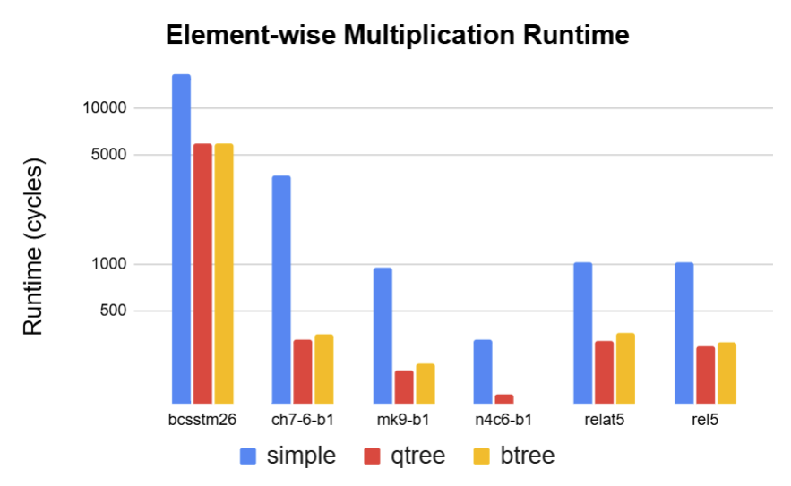

# Tiler-Swift

Tiler-Swift is an efficient tiling software to speed up sparse tensor operations on coarse-grained reconfigurable arrays (CGRAs) [1]. We will show the run time comparison between different sparse tiling strategies. This software will contain a tile size searching algorithm and an application performance model. They work as a feedback loop to determine the best tiling size to execute on CGRAs.

# Background and Setup

Specialized hardware has limited memory, so input data, often in the form of tensors, must be split into smaller segments called tiles. Usually, these tiles are of equal size to fit into memory efficiently. However, this method doesn't work well with sparse data, where some tiles have many zeros and others have many non-zero values. After compressing sparse data, tiles of the same initial size may end up with different storage sizes. To better use the hardware memory, we can use larger tiles that cover more of the input tensor, reducing the number of tiles needed.

To make Tiler-Swift work, it looks at three things. First, it checks how many zeros are in the input data. Second, it figures out what's being done to the data, so it can predict how much space it will need in the ouptut. Lastly, it needs to know about the computer's memory limits. These three things help Tiler-Swift decide how to split up the data into tiles. The result is a tiled picture based on these factors.

The tool has two main parts: the tiler and a performance model. They work together in a loop to find the best tiling that fits the given limits. The challenge is to work out how the tiling search algorithm operates, how the model predicts performance, and how they exchange information with each other.

# Approach

<!--

(approx 1-2 pages max)

Please describe your approach.  Please be brief (about a page or so max), but your description should be sufficiently detailed to provide the course staff a basic understanding of your approach. It might be very useful to include a figure here illustrating components of the system and/or their mapping to parallel hardware/or a DNN architecture.

* If your project involved optimizing code. Please describe the process of how you iterated toward a solution (what measurements did you make) What did you try that did not work? How to parts of the problem map to cores, threads, or vector lanes?

* If your project involved optimizing a DNN architecture, you could describe the architecture here, and be sure to provide intuition about how your model architecture choices were motivated by your goals.

* __If your project involved started with an existing piece of code or DNN model, please clearly describe what you started with here, so it's clear what work you actually did in your project. e.g., "We started with this codebase and made these changes..."__
-->

# Evaluation

## Hypothesis and Expectation

Before evaluating the proposed method, we present the list of key factors that would lead performance benefit and how Tiler-Swift can improve the overall hardware runtime by improving these factors. 

The first factor to improving the application runtime of our CGRA is by reducing reconfiguration time. Being a reconfigurable dataflow architecture, our CGRA needs to be reconfigured before every kernel(tile) execution to carry out the computation specified by the user. In other word, for every tile we run on the CGRA, a configuration time overhead is incurred. The goal of Tiler-Swift is to reduce the number of tiles by packing more nonzeros into data tiles.  As a result, the number tiles and the number of reconfiguration required to produced the final matrix is reudced, alleviating the reconfiguration overhead.

The second key factor is the reduction of the pipeline ramp-up and ramp-down time. Our CGRA implements a fully pipelined dataflow architecture by inserting hardware queues between processing elements to allow for overlapping of execution time. However, at the begining of each tile computation, the pipeline hardware queues would need to filled completely to achieve peak performance. Similarly, at the end of each tile, the pipeline queues are drained and the hardware no longer achieves peak pipelining performance. Tiler-Swift is able to mitigate excessive ramp-up and ramp-down overhead by reducing the total number of tiles and packing more data in each tile. By doing so, the tiles produced by the proposed method is able to keep the pipelining queues full for a longer period of time, achieving better overall performance.

The final key factor is the improved data reuse. For applications the exhitibit data reuse (e.g., matrix multiplication), a single piece of data is computed on multiple times before the results is produced. Through packing more data into a single tile, tiler-swift is able to improve the number of computations performed for each memory access, improving execution time.

## Evaluation Mehtodology

In our evaluation results, we simulate our CGRA using comal [3], a cycle accurate simulator that models the functionality and execution time of the dataflow architecture. Since reconfiguration time is not simulated in comal, we report the total confuguration time by muliplying the total number of kernels with the per-kernel configuration time obtained from the register transfer level (RTL) simulation of our hardware. The proposed method is evaluated using 5 selected sparse matrices from the SuiteSparse [4] dataset, and the sparse tensor operations evluated are matrix element-wise addition and matrix element-wise multiplication.

## Evaluation Results

The figure above compares the CGRA runtime () performing element-wise addtion between tiles produced by the simple, qtree, and btree tiler across different input data. Please note that the reported runtime only includes the execution time and does not take configuration time into account. It is demonstrated adopting the qtree and btree tiler, mean speedup of 2.97X and 2.62X can be achieved. Since the element-wise addition operation does not exhibit any data reuse, the perforamnce shown is through the improved pipelining resulting from bigger tiles.Through packing more data into each tiles, the tiles produced by qtree and btree are able to keep the pipeline full for a longer period of time compared to the simple tiler, resulting in higher pipelining throughput and shorter runtime.

<!--

    Additional questions that Kayvon & TAs want us to address

    * do more complex perf model, does that help with tiling results? how does it scale
    * does complex searching algorithm actually give you better results? can I just run brute force overnight, and it gives you best results?
-->

<!--

(as many pages as needed to make the points you want to make)

To the staff, this is the most important part of the writeup. Begin by providing your own definition of success (this should be in terms of your goals). In other words, re-iterate the question you were trying to answer, or the performance boost you were hoping to obtain. Then describe what data/experiment needs to be run to provide evidence that the goals were either met or not met.

Now describe the relevant parts of your experimental setup. What were the baseline algorithms? What machine was a performance test run on? What did you measure? What was the dataset used?  If you have a programming abstraction project, the experimental setup might include a description of the programs you implemented expressed using the API.

Finally, I want to see the results of an experiment that demonstrate success (or failure) to meet goals. Sometimes great projects fail to meet their goals, or falsify a hypothesis, but they still do a great job in the scientific process of verifying this.

This might include:

* Provide graphs of speedup or execution time?
* Compare total flops or model size
* Compare precision and recall of a model.
* Demonstrate that a 3D NeRF model was obtained, show output images of sufficient quality, etc.

IMPORTANT: In this writeup, I want you to interpret your graphs and numbers for me. What this means will be project dependent, but I want you to consider questions such as: Why does the graph look like it does? Does it make sense to you? What limited your speedup? Is it a lack of parallelism? (dependencies) Communication or synchronization overhead? Data transfer (memory-bound or bus transfer bound)? If a model is performing well, what are it's failure cases? When does it fail to generalize.

As you answer these questions, provide data and measurements to support your conclusions. If you are merely speculating, please state this explicitly. Performing a solid analysis of your implementation is a good way to pick up credit even if your optimization efforts did not yield the performance you were hoping for.
-->

# Team Responsibilities

<!--
Please provide a [very short] breakdown of which parts of the project were performed by each team member. In general we hope to (and intend to) give all team members the same grade, but we still want to know what everyone worked on and what their role was.   
-->

Both team members equally contributed to this project.
* Po-Han Chen (50%)
    * Software framework
    * Baseline searching algorithms and performance models
    * Result visualization
* Bo Wun Cheng (50%)
    * Integration with cycle accurate simulator [3]
    * Optimizating searching algorithms
    * Result collection and evaluation

# References
[1] K. Koul, et. al, "AHA: An Agile Approach to the Design of Coarse-Grained Reconfigurable Accelerators and Compilers," in ACM Transactions on Embedded Computing Systems (TECS), April 2022 (https://dl.acm.org/doi/full/10.1145/3534933)

[2] O. Hsu, et. al, "The Sparse Abstract Machine," in International Conference on Architectural Support for Programming Languages and Operating Systems (ASPLOS), March 2023 (https://dl.acm.org/doi/10.1145/3582016.3582051)

[3] R. Lacouture, et. al, "comal" (https://github.com/stanford-ppl/comal)

[4] T. Davis, et. al, "The university of Florida sparse matrix collection," in ACM Transactions on Mathematical Software, December 2011 (https://doi.org/10.1145/2049662.2049663)

