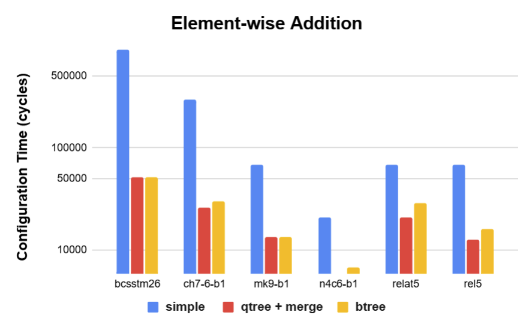
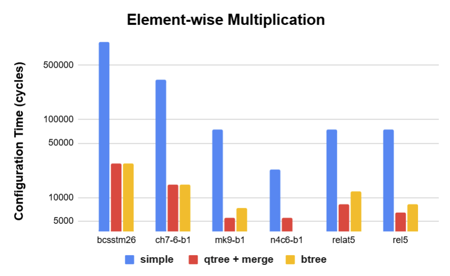

# Tiler-Swift

Tiler-Swift is an efficient tiling software to speed up sparse tensor operations on coarse-grained reconfigurable arrays (CGRAs) [1]. We will show the run time comparison between different sparse tiling strategies. This software will contain a tile size searching algorithm and an application performance model. They work as a feedback loop to determine the best tiling size to execute on CGRAs.

# Background and Setup

Specialized hardware has limited memory, so input data, often in the form of tensors, must be split into smaller segments called tiles. Usually, these tiles are of equal size to fit into memory efficiently. However, this method doesn't work well with sparse data, where some tiles have many zeros and others have many non-zero values. After compressing sparse data, tiles of the same initial size may end up with different storage sizes. To better use the hardware memory, we can use larger tiles that cover more of the input tensor, reducing the number of tiles needed.

    

To make Tiler-Swift work, it looks at three things. First, it checks how many zeros are in the input data. Second, it figures out what's being done to the data, so it can predict how much space it will need in the ouptut. Lastly, it needs to know about the computer's memory limits. These three things help Tiler-Swift decide how to split up the data into tiles. The result is a tiled picture based on these factors.

    

The tool has two main parts: the tiler and a performance model. They work together in a loop to find the best tiling that fits the given limits. The challenge is to work out how the tiling search algorithm operates, how the model predicts performance, and how they exchange information with each other.

    

# Approach

In this section, we will describe our approaches to design the tiling search algorithms and the performance models.

## Tiling Search
In the current implementation of Tiler-Swift, three distinct tiling search algorithms are available for user selection: `simple`, `qtree`, and `btree`. **These algorithms are designed on a shared assumption that larger tiles typically produce better results in terms of runtime.** This premise holds when accounting for tiling overheads, such as configuration time and pipeline initialization latency. Consequently, the algorithms prioritize attempting the largest feasible tile size initially and then strategically reduce the tile size until a feasible solution is found.

### Simple Search
In the simple search algorithm, input tensors are uniformly partitioned, resulting in tiles of equal size. The process begins with the largest possible tile, encompassing the entire original tensor. The algorithm then assesses whether this tile can fit within the available memory. If it cannot, the tile size is halved, and the assessment is repeated. This iterative process continues until all resulting tiles are sufficiently small to fit into memory. Due to the requirement to evaluate each tile in every iteration, the computational complexity increases exponentially as the algorithm approaches finer-grained tiles. Consequently, the runtime of the tool escalates significantly with each iteration as the tile sizes become progressively smaller.

### Quad-tree Search
In contrast to the simple search algorithm, the quad-tree implementation adopts a more selective approach to partitioning tensors. Instead of uniformly reducing the size of all tensors, this method only further subdivides tensors that fail to fit into memory. At each iteration, the algorithm initially checks if the given tensor can fit into the available memory. If it cannot, the tensor is divided into four quadrants, and the function is called recursively to assess the fit of each of the subdivided tensors. This targeted approach reduces unnecessary computations and handles tiling by focusing on problematic regions that require further division.

### Binary-tree Search
Similar to the quad-tree search, but instead of dividing them into four quadrants, we split them in half. The partitioning direction—either left/right or top/bottom—is determined based on the tensor's dimensions, with the longer side being halved to yield a more square-like shape compared to the quad-tree method. 

### Tile Merging
The three tiling algorithms can produce tiles with few non-zero elements due to uneven distribution of non-zeros in the tensor. For example, if non-zeros cluster in one corner, the algorithms will create dense tiles there and sparse tiles elsewhere. Merging these sparse tiles back into larger ones can improve efficiency. Our evaluation shows that applying tile merging to the quad-tree algorithm results in performance that is comparable to or better than the binary-tree method.

## Performance Model
The performance model aims to estimate the runtime of a given tiled tensor for a target operation, guiding the next iteration of the tiling process. Currently, we support only element-wise operations such as addition and multiplication, and use the number of output non-zeros as an indicator for runtime, assuming each output non-zero requires the same processing time. To expedite estimation and ensure tiling functionality, we use worst-case scenarios for our calculations. For element-wise addition, we assume no overlap among input non-zeros, making the output non-zeros equal to the total sum of input non-zeros. For element-wise multiplication, we assume complete overlap among input non-zeros, resulting in the number of output non-zeros being the maximum count from the input tensors.

For other more complex tensor operations such as matrix multiplication, the performance model needs to change and is listed in the future work section.

# Evaluation

## Hypothesis and Expectation

Before evaluating the proposed method, we present the list of key factors that would lead to performance benefits and how Tiler-Swift can improve the overall hardware runtime by improving these factors. 

The first factor in improving the application runtime of our CGRA is reducing reconfiguration time. Being a reconfigurable dataflow architecture, our CGRA must be reconfigured before every kernel(tile) execution to carry out the computation specified by the user. In other words, for every tile we run on the CGRA, a configuration time overhead is incurred. The goal of Tiler-Swift is to reduce the number of tiles by packing more nonzeros into data tiles.  As a result, the number of tiles and the number of reconfigurations required to produce the final matrix is reduced, alleviating the reconfiguration overhead.

The second key factor is the ability of the tile to keep the pipeline full. Our CGRA implements a fully pipelined dataflow architecture by inserting hardware queues between processing elements to allow for overlapped execution. However, at the start of each tile computation, the pipeline hardware queues would need to be filled to achieve peak performance (ramp-up time). Similarly, at the end of each tile, the pipeline queues are drained and the hardware no longer achieves peak pipelining performance (ramp-down time). Tiler-Swift can mitigate excessive ramp-up and ramp-down overhead by reducing the total number of tiles and packing more data in each tile. By doing so, the tiles produced by the proposed method can keep the pipelining queues full for a longer period, achieving better overall performance.

The final key factor is the improved data reuse. For applications that exhibit data reuse (e.g., matrix multiplication), a single piece of data is computed multiple times before the results are produced. Through packing more data into a single tile, tiler-swift can improve the number of computations performed for each memory access, improving execution time.

## Evaluation Mehtodology

In our evaluation results, we simulate our CGRA using comal [3], a cycle-accurate simulator that models the functionality and execution time of the dataflow architecture. Since reconfiguration time is not simulated in comal, we report the total configuration time by multiplying the total number of kernels with the per-kernel configuration time, which is fixed for the same sparse tensor operation, obtained from the register transfer level (RTL) simulation of our hardware. The proposed method is evaluated using 5 selected sparse matrices from the SuiteSparse [4] dataset, and the sparse tensor operations evaluated are matrix element-wise addition and matrix element-wise multiplication.

## Evaluation Results

### Execution Time Comparison 

    

The figure above compares the CGRA execution time performing element-wise addition between tiles produced by the simple, qtree, and btree tiler across different input data. It is demonstrated adopting the qtree and btree tiler, a mean speedup of 2.97X and 2.62X can be achieved.

    

The figure above presents the element-wise multiplication execution time comparison between tiles from different tilers. Thanks to the intersecting nature of the multiplication operation, the model is less conservative, and more aggressive tiling decisions can be made by the proposed tilers. As a result, the qtree and btree tiling algorithms demonstrate a mean speedup of 3.89X and 3.75X over the simple tiler, respectively.

Neither the element-wise addition operation nor the element-wise multiplication operation exhibit any data reuse. Furthermore, the results shown above only account for the execution time and not the configuration time. Therefore, the performance improvement demonstrated in these two experiments solely comes from the improved pipelining resulting from bigger tiles (the second key factor). By packing more data into each tile, the tiles produced by qtree and btree can keep the pipeline full for a longer period compared to the simple tiler, resulting in higher pipelining throughput and shorter runtime.

### Configuration Time Comparison 

    

The figure above presents the comparison of the total configuration time spent on configuring the CGRA to execute all the tiles produced by the simple, the qtree, and the btree tiler. On average, the qtree and btree tiling algorithms incurred 80.89% and 76.82% less configuration time compared to the simple tiler, respectively.

    

Similarly, the tiles produced by the qtree and btree tiler also demonstrate a significant reduction in configuration time compared to that produced by the simple tiler. As illustrated in the figure above, we observe reductions of 89.98% and 89.91% in configuration for tiles from the qtree tiling and the btree tiling algorithm respectively.

The above two experimental results demonstrate that the qtree and btree tiling algorithm is effective in packing more data into tiles, resulting in overall fewer data tiles at the end. This translates into lower configuration time overhead when we run the tiles on our CGRA, leading to higher performance (the first key factor)

Unfortunately, due to time constraints, we were unable to finish implementing the code that performs tiling for applications with memory reuse (such as matrix multiplication). Therefore, we are unable to show concrete results of how Tiler-Swift further pushes the performance boundary by addressing the third key performance factor. 

# Discussion

One of the key design focus of Tiler-Swift is the execution time of the tiler itself, as demonstrated by our simple and straight-forward tiler and performance model design. A more brute-force tiler and a more sophsticated performance model would have further improve the application runtime. However, given that the tiler is ran every single time a new data input is given, the extra tiler runtime introduced by the complex tiler and model may actually exceed that of the CGRA-accelerated appliation and becomes the performance bottleneck. In future work, we will evaluate and compare the current method against a more complicated tiler/model combination. 

# Conclusion

In this project, we proposed Tiler-Swift, a efficient input tiling framework for sparse tensor computation aimed at CGRAs. We proposed and implemented two efficient tree based tiling algorithms that aim to maximize memory utilization and improve perofrmance. Furthermore, we also implemented a simple performance model for guiding the tiling algorithm. In our experimental results, Tiler-Swift demonstrated superior application runtime and reduced configuration overhead by maintaining optimally utilized pipeline and reduced number of tiles. In our future work, we plan on extending the curreent implementation to cover applications that exhibit memory reuse to demonstrate the full potential of Tiler-Swift. We also intend to integrate Tiler-Swift to our RTL/Chip desting flow to boost the runtime of our actual hardware.

# Team Responsibilities

Both team members equally contributed to this project.
* Po-Han Chen (50%)
    * Software framework
    * Baseline searching algorithms and performance models
    * Result visualization
* Bo Wun Cheng (50%)
    * Integration with cycle accurate simulator [3]
    * Optimizating searching algorithms
    * Result collection and evaluation

# References
[1] K. Koul, et. al, "AHA: An Agile Approach to the Design of Coarse-Grained Reconfigurable Accelerators and Compilers," in ACM Transactions on Embedded Computing Systems (TECS), April 2022 (https://dl.acm.org/doi/full/10.1145/3534933)

[2] O. Hsu, et. al, "The Sparse Abstract Machine," in International Conference on Architectural Support for Programming Languages and Operating Systems (ASPLOS), March 2023 (https://dl.acm.org/doi/10.1145/3582016.3582051)

[3] R. Lacouture, et. al, "comal" (https://github.com/stanford-ppl/comal)

[4] T. Davis, et. al, "The university of Florida sparse matrix collection," in ACM Transactions on Mathematical Software, December 2011 (https://doi.org/10.1145/2049662.2049663)
